# 20. UML 다이어그램 — 데일리 슈크럼(SUPER scrum)

> 전체 시스템 흐름을 한눈에 파악할 수 있도록 정리한 UML 문서입니다.
> 모든 다이어그램은 Mermaid 문법으로 작성되었습니다.

---

## 목차

1. [ERD (Entity Relationship Diagram)](#1-erd)
2. [유스케이스 다이어그램](#2-유스케이스-다이어그램)
3. [시스템 아키텍처 (컴포넌트 다이어그램)](#3-시스템-아키텍처)
4. [인증 시퀀스 다이어그램](#4-인증-플로우)
5. [데일리 스크럼 작성 시퀀스 다이어그램](#5-데일리-스크럼-작성-플로우)
6. [보고서 자동 생성 시퀀스 다이어그램 (배치)](#6-보고서-자동-생성-배치-플로우)
7. [AI 요약 생성 시퀀스 다이어그램](#7-ai-요약-생성-플로우)
8. [보고서 파이프라인 상태 다이어그램](#8-보고서-파이프라인-상태-다이어그램)
9. [페이지 네비게이션 플로우차트](#9-페이지-네비게이션-플로우차트)
10. [팀 공유 시퀀스 다이어그램](#10-팀-공유-플로우)

---

## 1. ERD

7개 테이블 간의 관계를 나타냅니다.

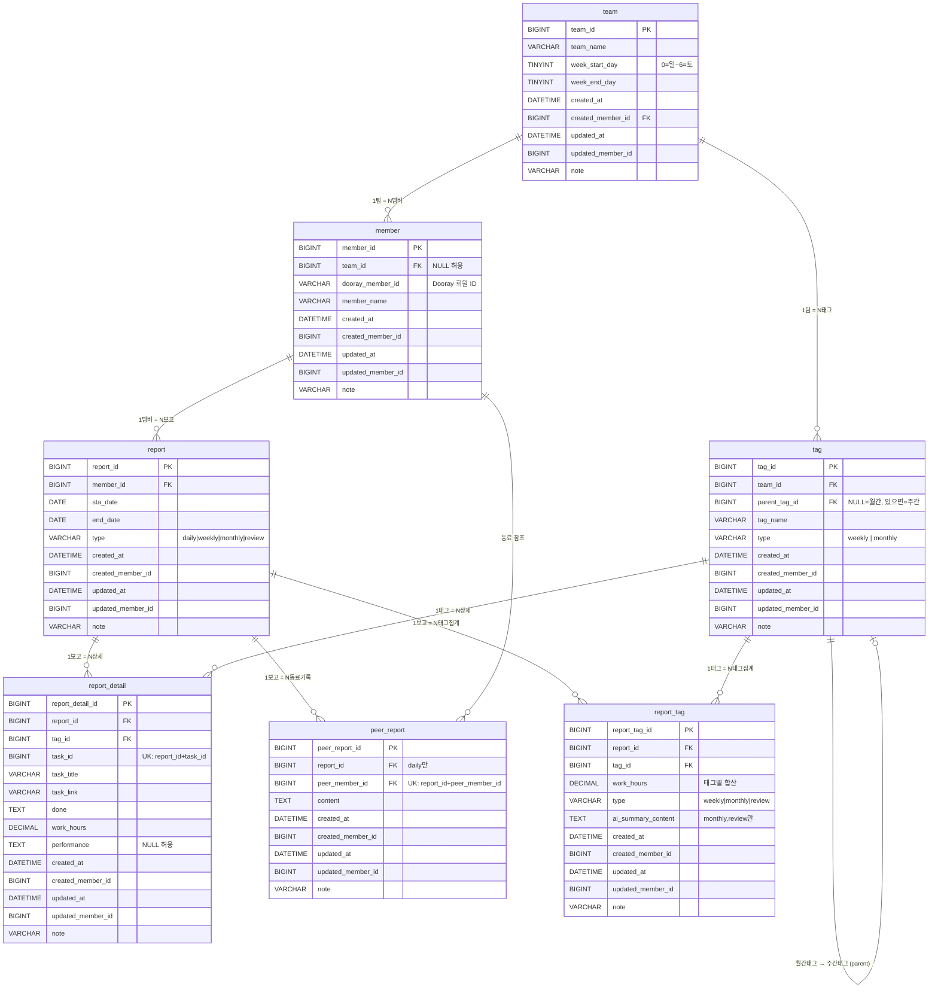

---

## 2. 유스케이스 다이어그램

액터(팀장, 팀원, 배치, AI)별 기능을 정리합니다.

```mermaid
graph TB
    subgraph Actors
        TL["🧑‍💼 팀장"]
        TM["🧑‍💻 팀원 (공통)"]
        BATCH["⏰ 배치 스케줄러"]
        AI["🤖 Claude AI"]
    end

    subgraph "팀 관리"
        T1["T-1 팀 생성"]
        T2["T-2 주간 시작/종료 요일 설정"]
        T3["T-3 주간 태그 관리"]
        T4["T-4 월간 태그 관리"]
    end

    subgraph "팀 참여"
        T5["T-5 팀 검색"]
        T6["T-6 팀 배정 (본인)"]
    end

    subgraph "데일리 스크럼"
        D1["D-1 Dooray 업무 자동 로드"]
        D2["D-2 데일리 스크럼 저장"]
        D3["D-3 행 추가"]
        D4["D-4 행 삭제"]
        D5["D-5 주간 태그 선택 (필수)"]
        D6["D-6 데일리 스크럼 수정"]
        D7["D-7 데일리 스크럼 삭제"]
        D8["D-8 동료 협업 기록 저장"]
        D9["D-9 동료 협업 기록 수정/삭제"]
    end

    subgraph "보고서 조회/관리"
        R1["R-1 일간 보고 목록"]
        R2["R-2 주간 보고 목록"]
        R3["R-3 월간 보고 목록 + AI 요약"]
        R4["R-4 성과 보고 목록 + AI 요약"]
        R5["R-5 주간 보고 수정/삭제"]
        R6["R-6 월간 보고 수정/삭제/재생성"]
        R7["R-7 성과 보고 생성 (기간 지정)"]
        R8["R-8 성과 보고 수정/삭제"]
    end

    subgraph "팀 공유"
        S1["S-1 팀 일간 보고 조회"]
        S2["S-2 팀 주간 보고 조회"]
        S3["S-3 팀 월간 보고 조회"]
        S4["S-4 가동률 산출"]
    end

    subgraph "배치 / AI"
        B1["B-1 주간 보고 자동 생성 (매일 3AM)"]
        B2["B-2 월간 보고 자동 생성 (25일 5AM)"]
        A1["A-1 월간 AI 요약 (200자)"]
        A2["A-2 성과 AI 요약 (500자)"]
    end

    TL --> T1 & T2 & T3 & T4
    TM --> T5 & T6
    TM --> D1 & D2 & D3 & D4 & D5 & D6 & D7 & D8 & D9
    TM --> R1 & R2 & R3 & R4 & R5 & R6 & R7 & R8
    TM --> S1 & S2 & S3 & S4
    BATCH --> B1 & B2
    AI --> A1 & A2
    B2 -.->|트리거| A1
    R7 -.->|트리거| A2
```

---

## 3. 시스템 아키텍처

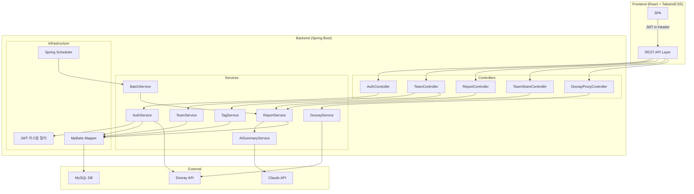

---

## 4. 인증 플로우

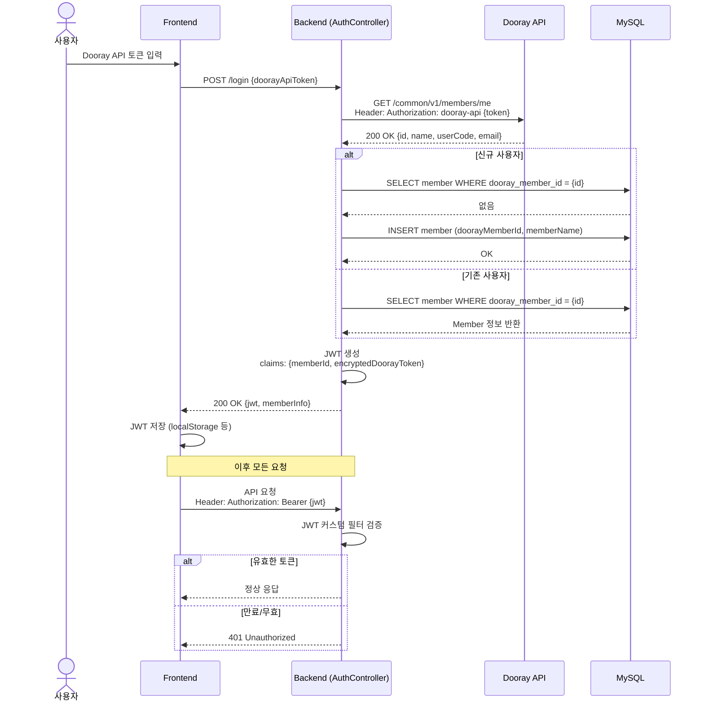

---

## 5. 데일리 스크럼 작성 플로우

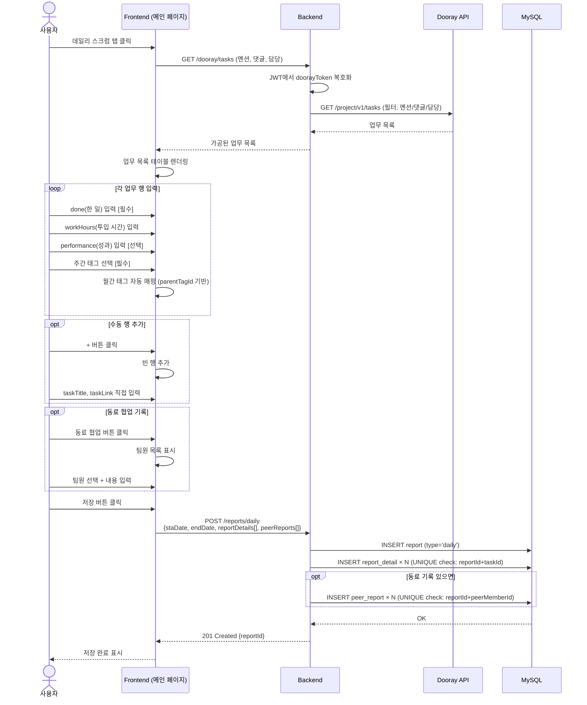

---

## 6. 보고서 자동 생성 (배치) 플로우

### 6-1. 주간 보고 자동 생성 (매일 새벽 3시)

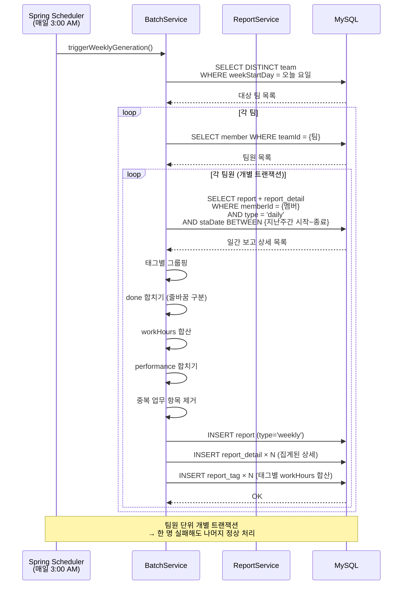

### 6-2. 월간 보고 자동 생성 (매월 25일 새벽 5시)

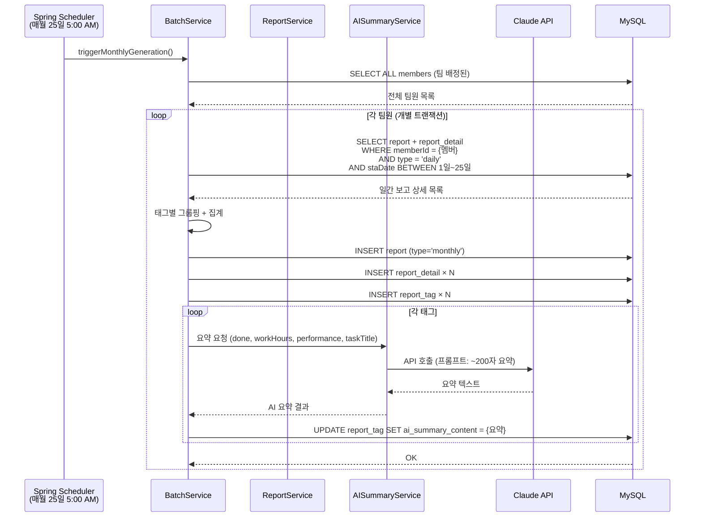

---

## 7. AI 요약 생성 플로우

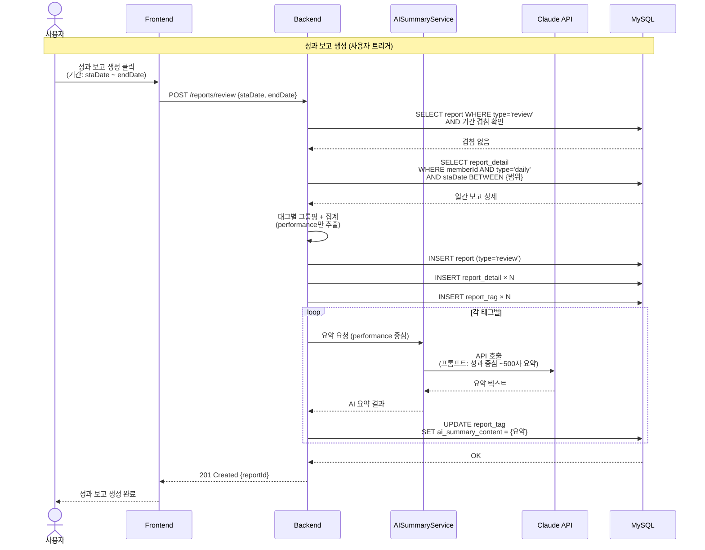

---

## 8. 보고서 파이프라인 상태 다이어그램

일간 → 주간 → 월간 → 성과 보고로 이어지는 데이터 흐름의 상태를 나타냅니다.

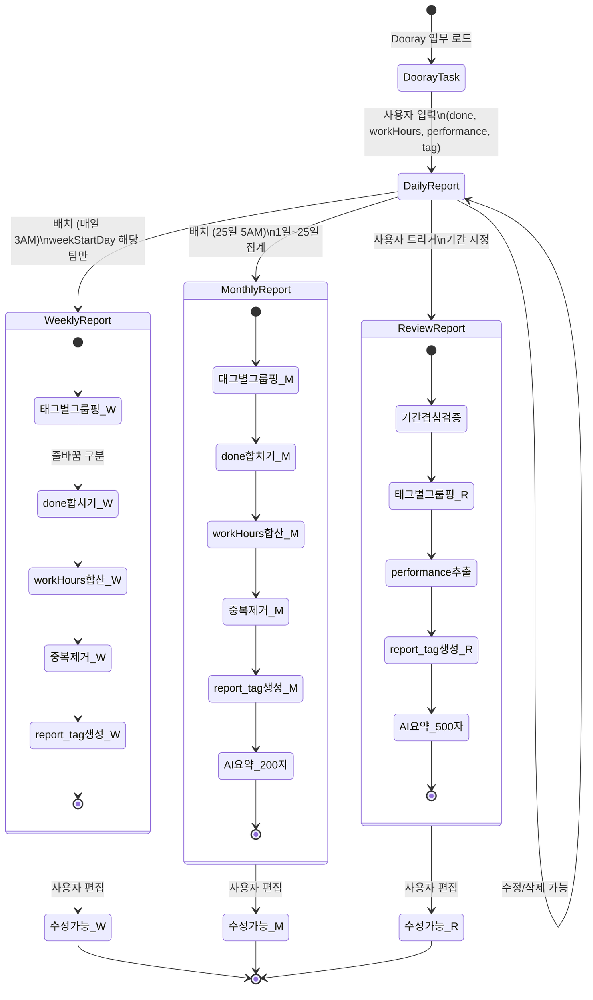

---

## 9. 페이지 네비게이션 플로우차트

10개 페이지 간의 이동 흐름과 조건 분기를 나타냅니다.

```mermaid
flowchart TD
    START(["사용자 접속"]) --> LOGIN["POST /login\nDooray 토큰 입력"]
    LOGIN --> CHECK_TEAM{"팀 배정 여부?"}

    CHECK_TEAM -->|미배정| PAGE2["📋 팀 배정 페이지\n/team/assign\n- 팀 검색 (T-5)\n- 팀 배정 (T-6)"]
    PAGE2 --> MAIN

    CHECK_TEAM -->|배정됨| MAIN

    MAIN["🏠 메인 (데일리 스크럼)\n/ \n- Dooray 업무 로드 (D-1)\n- 스크럼 저장 (D-2)\n- 행 추가/삭제 (D-3,4)\n- 태그 선택 (D-5)\n- 동료 기록 (D-8,9)"]

    subgraph LEFT_MENU["좌측 메뉴"]
        TEAM_MGMT["⚙️ 팀 관리\n/team/manage"]
        MY_REPORT["📊 내 보고서"]
        TEAM_SHARE["👥 팀 공유"]
    end

    MAIN --> LEFT_MENU

    TEAM_MGMT --> PAGE1["팀 관리 페이지\n- 팀 생성 (T-1)\n- 일정 설정 (T-2)\n- 태그 관리 (T-3,4)"]

    MY_REPORT --> TAB_GROUP

    subgraph TAB_GROUP["내 보고서 탭"]
        TAB1["📝 데일리 스크럼 작성\n(기본 탭)"]
        TAB2["📋 일간 보고\n/reports/daily\n- 목록 (R-1)\n- 수정 (D-6)\n- 삭제 (D-7)"]
        TAB3["📅 주간 보고\n/reports/weekly\n- 목록 (R-2)\n- 수정/삭제 (R-5)\n- 자동+수동 생성"]
        TAB4["📊 월간 보고 (GRM)\n/reports/monthly\n- 목록 (R-3)\n- 수정/삭제/재생성 (R-6)\n- AI 요약 200자 (A-1)"]
        TAB5["🏆 성과 보고\n/reports/review\n- 목록 (R-4)\n- 생성 (R-7, 기간 지정)\n- 수정/삭제 (R-8)\n- AI 요약 500자 (A-2)"]
    end

    TAB1 --> MAIN

    TEAM_SHARE --> SHARE_TABS

    subgraph SHARE_TABS["팀 공유 탭"]
        SHARE_D["👥 팀 일간 (S-1)\n/team/share/daily"]
        SHARE_W["👥 팀 주간 (S-2)\n/team/share/weekly"]
        SHARE_M["👥 팀 월간 (S-3)\n/team/share/monthly"]
    end

    SHARE_D & SHARE_W & SHARE_M --> UTIL["가동률 산출 (S-4)\nworkHours / 일총시간 × 100"]

    style MAIN fill:#e1f5fe
    style LOGIN fill:#fff9c4
    style PAGE2 fill:#fff9c4
    style UTIL fill:#f3e5f5
```

---

## 10. 팀 공유 플로우

팀원 보고서 조회 시 민감 정보 필터링 처리를 나타냅니다.

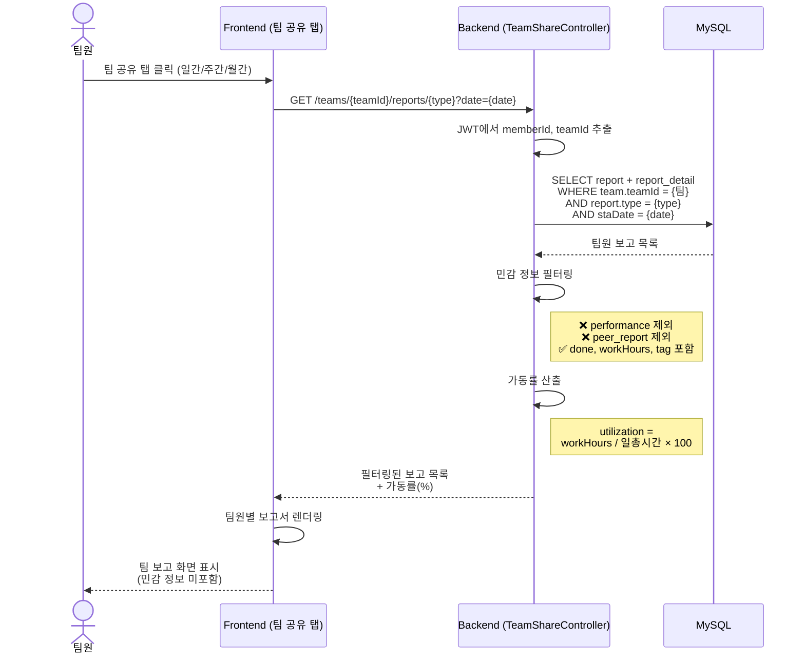

---

## 부록: 태그 계층 구조

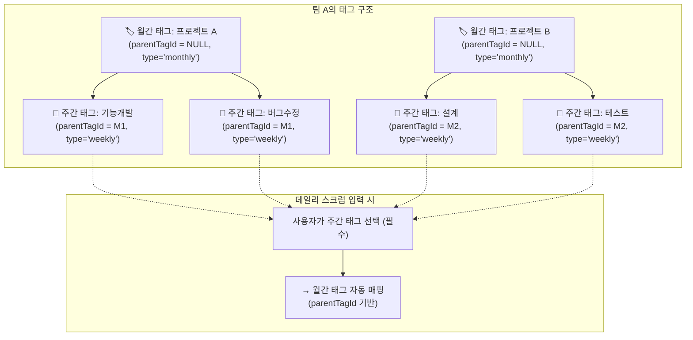

---

## 다이어그램 요약

| # | 다이어그램 | 설명 | 핵심 포인트 |
|---|-----------|------|------------|
| 1 | ERD | 7개 테이블 관계도 | tag 계층, report 타입 분류, UNIQUE 제약 |
| 2 | 유스케이스 | 액터별 31개 기능 | 팀장 vs 팀원 vs 배치 vs AI 역할 분리 |
| 3 | 시스템 아키텍처 | 컴포넌트 구성도 | No Spring Security, MyBatis, Dooray 프록시 |
| 4 | 인증 시퀀스 | 로그인 플로우 | Dooray 토큰 → JWT 발급 → 커스텀 필터 |
| 5 | 데일리 작성 시퀀스 | 메인 기능 플로우 | Dooray 로드 → 입력 → 저장 (report+detail+peer) |
| 6 | 배치 시퀀스 | 주간/월간 자동 생성 | 팀원 단위 개별 트랜잭션, 태그별 집계 |
| 7 | AI 요약 시퀀스 | 성과 보고 AI 생성 | 기간 겹침 검증, 태그별 500자 요약 |
| 8 | 상태 다이어그램 | 보고서 파이프라인 | daily → weekly/monthly/review 데이터 흐름 |
| 9 | 페이지 네비게이션 | 10개 페이지 이동 흐름 | 팀 미배정 분기, 탭 구조, 기능 매핑 |
| 10 | 팀 공유 시퀀스 | 민감 정보 필터링 | performance/peer 제외, 가동률 산출 |
